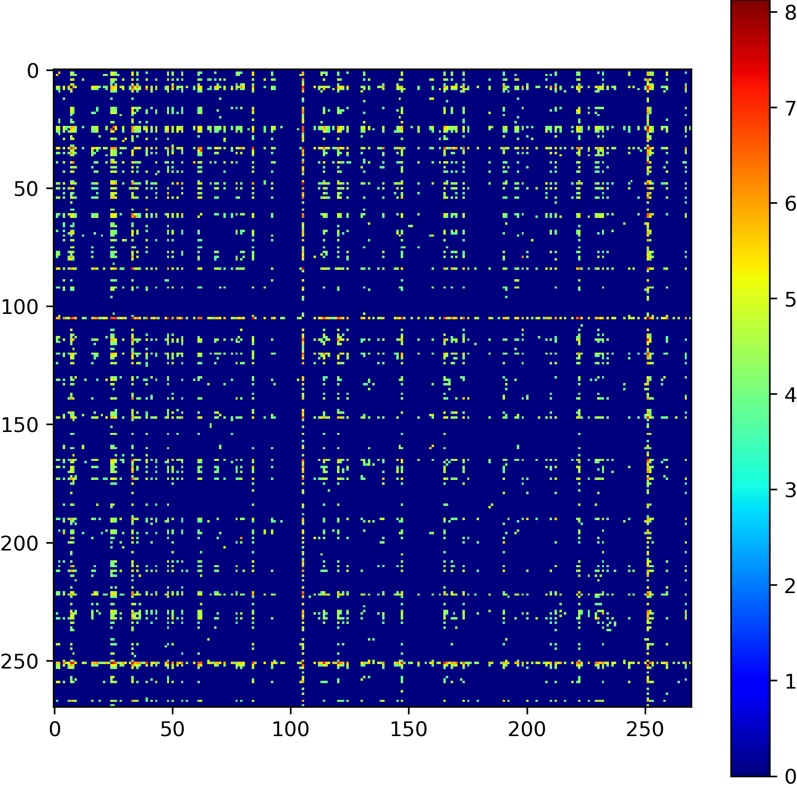
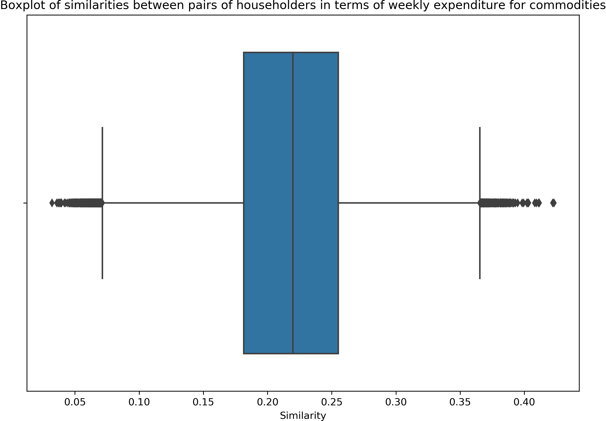
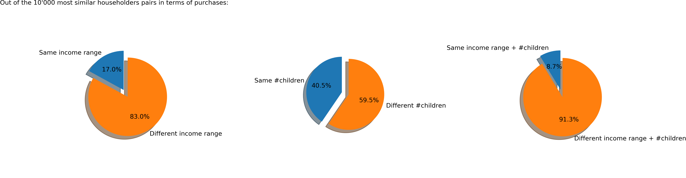

---
# Feel free to add content and custom Front Matter to this file.
# To modify the layout, see https://jekyllrb.com/docs/themes/#overriding-theme-defaults

layout: page
title: Applied Dunnhumby Analysis
bigimg: /img/banner.jpg
---

# Introduction

You walk into a retail store. The moment you walk in, you notice several others are there to shop like you. Perhaps if something interests you, you may spontaneously choose to include it in your basket, but you have come to the store for a reason. Maybe you even have a list of things to buy in mind. That is, your shopping list is not purely random; it is constructed with purpose and the items included in it have meaningful economic relationships. But it's not just you. Everyone shops with purpose.

This project aims to explore how people consume goods and what might influence the purchase of these goods by studying a large number of transactions from "The Complete Journey" dataset from Dunnhumby. The data includes over 275,000 baskets in total composed from any number of items from hundreds of unique commodities purchased by more than 2,500 households in over two years. This rich dataset offers ample opportunities to extract meaningful economic insights and perspectives such as:
*	Which goods are the most purchased and which are the least purchased?
*	What goods are frequently or rarely associated together?
*	Do the income and/or the number of children have an influence on the purchases?

# Let us take a peek at your basket

Studying quantities or sales value is not so interesting because different products can have wildly varying quantities and unit prices which may obscure our analysis. Instead, we focus on taking a peek at each basket in the transaction history and keeping track of product counts. 

The number of items in a basket can range from 1 to 80 with an average size being 7 items. So most people buy under 10 products although there are certainly a few big shoppers from time to time. The product counts from all baskets allows us to discover products have been purchased the most often:

One would expect that products at the top of the ranking are cheap and basic goods. Indeed, we can see that the top 5 contains soft drinks, dairy products, bread, snacks and cheese, all of which are classic examples of inferior goods.

Interestingly, the most common bought product, SOFT DRINKS, is found in only 6% of the baskets. This result informs us that no products are systematically dominant in terms of purchases. This is a good indication of the inherent variety of purchases, and therefore we have a nice environment to study relationships between products.

Beyond just keeping track of product counts, we can keep track of the number of times a product is seen together with another product. This analysis leads to what we call the "co-purchase matrix" whose values indicate the total number of baskets in which any pair of products 
For this purpose, we first created a graph in which each node represents a product, and by clicking on one node/product, we can visualize which products were purchased at least once with this particular product. 


Another important visualization of these relationships might be obtained by studying the co-purchase matrix of the products, and see if patterns or correlations can be observed. Note that the above graph illustrates the relationships present in the co-occurence matrix, but does not take into account the number of times two products have been bought together. Therefore, this additional visualization allow us to get different information, by expliciting the number of products bought with a particular product, and the number of times it has been the case.

As we can see on the above co-purchase matrix, some products are always bought alone, whereas some others are bought with a lot of other products (these should be the above most purchased products among all baskets). Note that higher value of the co-occurence matrix does correspond to a higher number of co-purchase for two given products. 

Now, another interesting point to study is the identification of bridges among our products. A bridge basically is a pair of products that are exclusively bought together, without any other product. Bridges are an interesting component because they might represent links between distinct clusters of products (see more about that on the next paragraph), considering our product network. Furthermore, they offer an interesting economic insight in its own way. Here are the interesting bridges we identified in our product network: (product of the right is the only other product to which product of the left was linked)
*	FUEL -> CIGARETTES
*	ROSES -> GREETING CARDS/WRAP/PARTY SPLY
*	SANDWICHES -> SOFT DRINKS
*	CHIPS&SNACKS -> SOFT DRINKS
*	SYRUPS/TOPPINGS -> ICE CREAM/MILK/SHERBTS

As we can see, these bridges are quite intuitive. Now, a central aspect of the study of the product network is to identify groups or "clusters" of products, which are often bought together and form "communities" that are intuitive in the economical point of vue. After having tried to remove bridges to get these groups, we figured out that every bridge was only linking one particular product to a giant component. Therefore, we had to proceed with another tool to find groups. We got pretty interesting results using cliques, which aer groups of products in which all pairwise combinations have been purchased at least once together. Below, you will find an interactive plot in which you have the possibility to select some cliques and highlight them in the product network.

(interactive cliques plot here)

As you might have seen on the above plot, we have some interesting cliques that are intuitive economically. Some noticable examples are listed here:
*	Clique 4: Soft drinks, Fluid milk products, Pet care supplies, Candy–checklane, Dog foods, Cat food 
*	Clique 11 : Soft drinks, Fluid milk products, Cheese, Imported wine, Domestic wine, Beers/ales
*	Clique 15 : Soft drinks, Fluid milk products, Cheese, Beef, Broccoli/cauliflower, Tomatoes, Onions, Salad mix, Carrots 
*	Clique 322 : Soft drinks, Fluid milk products, Cheese, Popcorn, Candy-checklane, Candy-packaged

We can see in the examples presented above that "Soft drinks" and "Fluid milk products" appear in a lot of cliques. This is consistent with the first results where we observed that "Soft drinks" and "Fluid milk products" are the two most present products in the baskets.

This shows that some patterns can be observed. What could be some driving factors for these patterns? This will be the subject of the next section, where two potential factors were studied: the household’s income and the number of children.

# Study of potential econonomic factors on purchases

After a study of household's income repartition and creation of income ranges, we started with a study around similarities between householders in terms of weekly expenditure for a given commoditiy (which does represent a group of products). Note that expenditure is simply quantity multiplied by AUP (Actual Unit Price), and that our similarity metric is obtained by computing the Jaccard similarity between two given householders where the intersection is weighted by the difference in expenditure for each commodity.

A first interesting result is obtained when we study repartition of these similarities among every pairs of householders. You can find this result on the boxplot below.

We can notice that a good proportion (actually, about 46.9%) of pairs of households have a similarity value greater than 0.2. Then, we picked 10'000 pairs of householders with highest similarity of expenditure among commodities and figured out the following statistics:

To justify that these percentages are quite interesting, we computed that if there is no correlation, 
*	15.4% of householders pairs are expected to be in the same income range;
*	33.3% of householders pairs are expected to have the same number of children;
*	11.1% of householders pairs are expected to be in the same income range and have the same number of children.

A possible explanation to the fact that the numbers we obtained are quite close to the numbers "without correlation" is that there are only a few products related with the household income range and number of children. Another possible explanation is that the products related to those factors were purchased in other (perhaps specialized in luxury items / items related to children) stores not included in this dataset.

Now that we had an approach regarding the householders, we are going to move on the study of commodities that might be correlated to householders' income and/or number of children.

[plot of correlation of commodities with income, decreasing order, top 20, + top 3 HH income VS weekly expenditure]

As we can see on the above plot, the three commodities most correlated with the income are Suntan, Home health care and Snack nuts. It was found that for Suntan products and Home health care products, the weekly expenditure increases as the household’s income increases. These types of products can be considered as luxury products and are expected to correlate with income. However, another interesting result we obtained was for Snack nuts products for which the same effect is observed. This might be more surprising, but it might be explained by the fact that they are usually more expensive than other snacks.

Below, you will find the same study as before, but this time for the correlation between the commodities and the number of children:

[plot of correlation of commodities with #children, decreasing order, top 20, + top 3 HH income VS weekly expenditure]

Here, we can see that the three commodities most correlated with the number of children are Convenient brkfst/whlsm snacks, Halloween and Glassware and dinnerware. As before, as the number of children in the household increases, the weekly expenditure also increases. Here, the most correlated commodities make sense, as these are more "children related" commodities, except maybe for Glassware and dinnerware, maybe children tend to break dishes or glasses.

Now, the following plot is a nice visual representation of correlations between products and both factors we studied before in this section:

It appears plausible to detect groups or communities among products based on their relationships with income and number of children. It could then be interesting to study the influence of income on purchases of these groups and obtain a more comprehensive understanding of consumption behavior.

# Third section

Add third section here

# Conclusion

Add third section here
