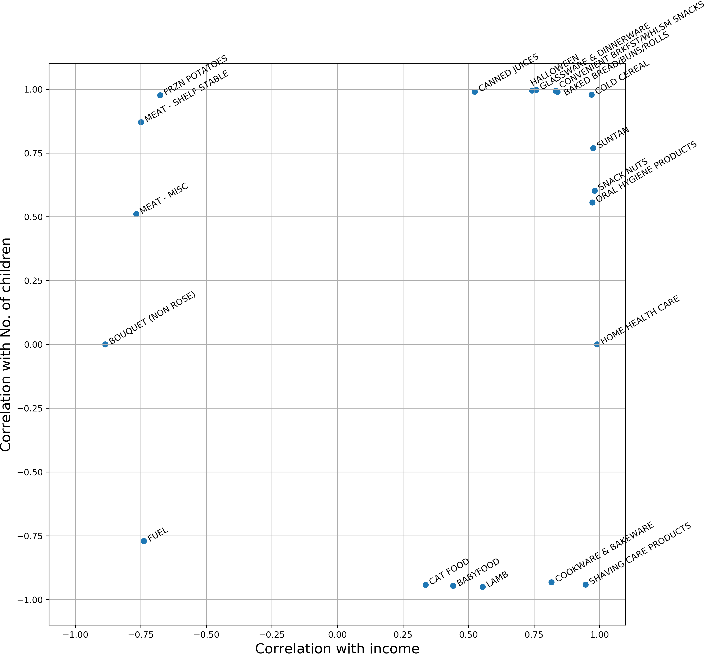

---
# Feel free to add content and custom Front Matter to this file.
# To modify the layout, see https://jekyllrb.com/docs/themes/#overriding-theme-defaults

layout: page
title: Applied Dunnhumby Analysis
bigimg: /img/banner.jpg
---

# Introduction

This project aims to explore how people consume goods and what might influence the purchase. For that, The Complete Journey dataset from Dunnhumby was used). It provides various information about transactions from 2’500 households at a retailer over two years (content of their baskets, use of coupons, household’s information, etc.).
Having access to these information offers interesting perspectives, such as :
•	Which goods are the most purchased and which are less ?
•	What goods are frequently or rarely bought together ?
•	Do the income and the number of children have an influence on the purchases ?
•	Last section

# First section

First, we focused on finding which types of good (commodities) are the most purchased. We used the content of the baskets to find which products appeared the most. The most purchased products are presented in the following plot :

One would expect that products which are purchased in the higher number of baskets are cheap and basic goods. We can see that, indeed, the top 5 contains soft drinks, dairy products, bread, snacks and cheese.

However, we see that the most common bought commodity was found in only 6% of the baskets.
This result led us to study the co-purchase aspect of the baskets to see if patterns or correlations can be observed.

A network was created to look at the relationship between the types of products. For that, the commodities are represented as nodes. This allows to visualize which commodities are bought together and how often :
(network graph)

Examples of cliques :
-Clique 4 : Soft drinks, Fluid milk products, Pet care supplies, Candy–checklane, Dog foods, Cat food
-Clique 11 : Soft drinks, Fluid milk products, Cheese, Imported wine, Domestic wine, Beers/ales
-Clique 15 : Soft drinks, Fluid milk products, Cheese, Beef, Broccoli/cauliflower, Tomatoes, Onions, Salad mix, Carrots
-Clique 322 : Soft drinks, Fluid milk products, Cheese, Popcorn, Candy-checklane, Candy-packaged

We can see in the examples presented above that Soft drinks and Fluid milk products appear in a lot of cliques. This is consistent with the first results where we observed that Soft drinks and Fluid milk products are the two most present products in the baskets.

This shows that some patterns can be observed. What could be some driving factors for these patterns ?
This will be the subject of the next section, where two potential factors were studied : the household’s income and the number of children.

# Second section

Let’s look at the relationship between the household’s income, the number of children, and the weekly expenditure for different commodities.

a)	Household’s income :

The three commodities most correlated with the income are Suntan, Home health care and Snack nuts. It was found that for Suntan products and Home health care products, the weekly expenditure increases as the household’s income increases. These types of products can be considered as luxury products and are expected to correlate with income. However, another interesting result we obtained was for Snack nuts products for which the same effect is observed. This might be more surprising, but it might be explained by the fact that they are usually more expensive than other snacks.

b)	Number of children :

The three commodities most correlated with the number of children are Convenient brkfst/whlsm snacks, Halloween and Glassware and dinnerware. As the number of children in the household increases, the weekly expenditure increases also.

The following plot shows the combination of both studied factors on the different commodities :

It appears plausible that we can detect groups or communities among products based on their relationships.
It could then be interesting to study the influence of income on purchases of these groups and obtain a more comprehensive understanding of consumption behavior.

# Third section

Add third section here
