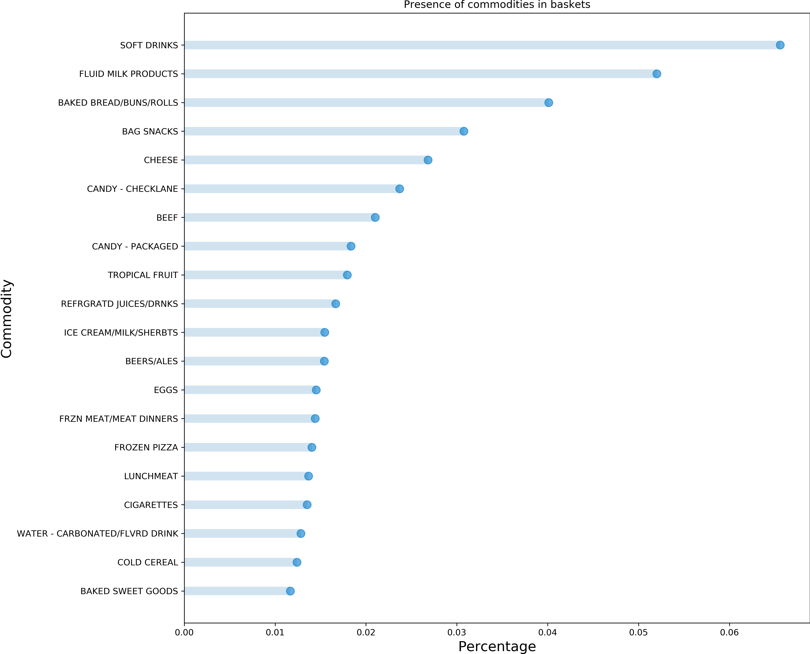

---
# Feel free to add content and custom Front Matter to this file.
# To modify the layout, see https://jekyllrb.com/docs/themes/#overriding-theme-defaults

layout: page
title: Applied Dunnhumby Analysis
bigimg: /img/banner.jpg
---

# Introduction

You walk into a retail store. The moment you walk in, you notice several others are there to shop like you. Perhaps if something interests you, you may spontaneously choose to include it in your basket, but you have come to the store for a reason. Maybe you even have a list of things to buy in mind. That is, your shopping list is not purely random; it is constructed with purpose and the items included in it have meaningful economic relationships. But it's not just you. Everyone shops with purpose.

This project aims to explore how people consume goods and what might influence the purchase of these goods by studying a large number of transactions from "The Complete Journey" dataset from Dunnhumby. The data includes over 275,000 baskets in total composed from any number of items from hundreds of unique commodities purchased by more than 2,500 households in over two years. This rich dataset offers ample opportunities to extract meaningful economic insights and perspectives such as:
*	Which goods are the most purchased and which are the least purchased?
*	What goods are frequently or rarely associated together?
*	Do the income and/or the number of children have an influence on the purchases?

# Let us take a peek at your basket

Studying quantities or sales value is not so interesting because different products can have wildly varying quantities and unit prices which may obscure our analysis. Instead, we focus on taking a peek at each basket in the transaction history and keeping track of product counts. 

The number of items in a basket can range from 1 to 80 with an average size being 7 items. So most people buy under 10 products although there are certainly a few big shoppers from time to time. The product counts from all baskets allows us to discover products have been purchased the most often:

One would expect that products at the top of the ranking are cheap and basic goods. Indeed, we can see that the top 5 contains soft drinks, dairy products, bread, snacks and cheese, all of which are classic examples of inferior goods.

Interestingly, the most common bought product `SOFT DRINKS` is found in only 6% of the baskets. This result informs us that no products are systematically dominant in terms of purchases. This is a good indication of the inherent variety of purchases, and therefore we have a nice environment to study relationships between products.

Beyond just keeping track of product counts, we can keep track of the number of times a product is seen together with another product. This analysis leads to what we call the "co-purchase matrix" whose values indicate the total number of baskets that any pair of products were purchased together. This result can be most naturally visualized in the form of a network where each node represents a product and the weight of an edge is the value from the co-purchase matrix. By clicking on one node/product, we can visualize all other products that this particular product have been purchased with at least once in the past.



Note that the above network illustrates the co-purchase relationships from the study of the baskets, but does not actually weigh the edges by the number of times two products have been bought together. A heat map, therefore, may allow us to uncover any additional correlations or patterns by expliciting presenting the weight which is equal to the log-normalized number of total co-purchase counts.

In the symmetric matrix above where the y- and x-axis represent the indices of the unique products, two products stand out: `SOFT DRINKS` and `FLUID MILK PRODUCTS`. These correspond to the particularly bright columns (or rows) in the heat map. Despite the fact that a product appears at best in only 6% of the baskets, these two products have a strong co-purchase association with nearly all other products in the retailer. 

The network now unlocks a number of interesting graph analysis for us. In particular, we focused on identifying bridges. A bridge is an edge which, when removed, creates two disconnected components in the network. In this project, bridges offer an interesting economic insight in its own way because by removing them we were able to isolate products which have only been co-purchased with only a single other product. Below are the interesting bridges we found in our product network. The product on the left is the isolated product and the product on the right was the only product it was ever purchased with:
*	`FUEL` -> `CIGARETTES`
*	`ROSES` -> `GREETING CARDS/WRAP/PARTY SPLY`
*	`SANDWICHES` -> `SOFT DRINKS`
*	`CHIPS&SNACKS` -> `SOFT DRINKS`
*	`SYRUPS/TOPPINGS` -> `ICE CREAM/MILK/SHERBTS`

As we can see, these bridges are quite intuitive. For example, when people come to buy `FUEL` (gas), it is often the only thing they buy, or if bought with anything else, it is always purchased with `CIGARETTES`. Similarly, `CHIPS&SNACKS` are always seen together with `SOFT DRINKS` if it isn't the only thing in the basket.

Now, the central aspect of the study of the product network is to identify groups or communities of products based on the co-purchase occasions that are intuitive in the economical point of view. To this end, we obtained interesting results using "cliques". A group of products is a clique if there exists at least one co-purchase count between every pair of products. Below, you will find an interactive plot in which you have the possibility to select some cliques and highlight them in the product network.

(interactive cliques plot here)

As you might have seen on the above plot, we have some interesting cliques that are intuitive economically. Some notable examples are listed here:
*	Clique 4: `SOFT DRINKS`, `FLUID MILK PRODUCTS`, `PET CARE SUPPLIES`, `DOG FOODS`, `CAT FOOD`, `CANDY - CHECKLANE`
*	Clique 11 : `SOFT DRINKS`, `FLUID MILK PRODUCTS`, `IMPORTED WINE`, `DOMESTIC WINE`, `BEERS/ALES`
*	Clique 15 : `SOFT DRINKS`, `FLUID MILK PRODUCTS`, `CHEESE`, `BEEF`, `BROCCOLI/CAULIFLOWER`, `TOMATOES`, `ONIONS`, `SALAD MIX`, `CARROTS` 
*	Clique 322 : `SOFT DRINKS`, `FLUID MILK PRODUCTS`, `CHEESE`, `POPCORN`, `CANDAY - CHECKLANE`, `CANDY - PACKAGED` 

In clique 4, one may surmise that the community is closely related to "pet products". Similarly, clique 11 would be named "alcoholic drinks". We can see in the examples presented above that `SOFT DRINKS` and `FLUID MILLK PRODUCTS` appear in a lot of cliques. This is consistent with the first results where we observed that they are the two most present products in the baskets as well as the co-purchase matrix. 

By constructing the co-purchase matrix and defining cliques, we managed to extract some patterns in how people consume. But what could be some driving factors for these patterns? This will be the subject of the next section, where two economic factors were studied: the household’s income and the number of children.

# Do children and household income matter?

Household income in the dataset largely falls into 12 brackets from "under 15K" to "200-249K" with the median income at approximately $29,500. It also turns out that roughly 64% of the households do not have children, so we can see that the retailer is mainly visited by low-income family units with no dependents.

One approach to studying the effect of household income on consumption patterns is to analyze the weekly average expenditures per product per household in each income bracket to identify any statistically significant differences between brackets. A similar analysis can be conducted in each number-of-children bracket which varies from "0" to "3+". Below are three most correlated products with income and number of children respectively.

(Normalized curves of three most correlated products with household income)

Products such as `SUNTAN` and `HOME HEALTH CARE` are luxury products and are expected to correlated with income. `SUNTAN`, for example, correlates well with the number of occasions of vacation while `HOME HEALTH CARE` products can include personal care, drugs, and medical equipment. `SNACK NUTS` are a bit more surprising, but the fact that they are typically on a higher end relative to other snacks may help explain this. 

(Normalized curves of three most correlated products with number of children)

It appears logical that `HALLOWEEN`, which spans anything from decorating lights to costume accesories, is strongly correlated with the number of children. Likewise, `GLASSWARE & DINNERWARE` is expected to correlate with increasing size of the family unit.

Which of these items are strongly correlated with both household income *and* the number of children? Which ones are only closely related to either one exclusively? The mapping of some of the most interesting products in these two dimensions is demonstrated below.

How can we complement this analysis with the cliques we found in the product network? Could the relationship between a household's weekly expenditure and its income somehow depend on the cliques rather than individual products? For a more comprehensive economic understanding, we now turn towards combining the results from the product network with household income analysis.

# Third section

# Conclusion

Add third section here
